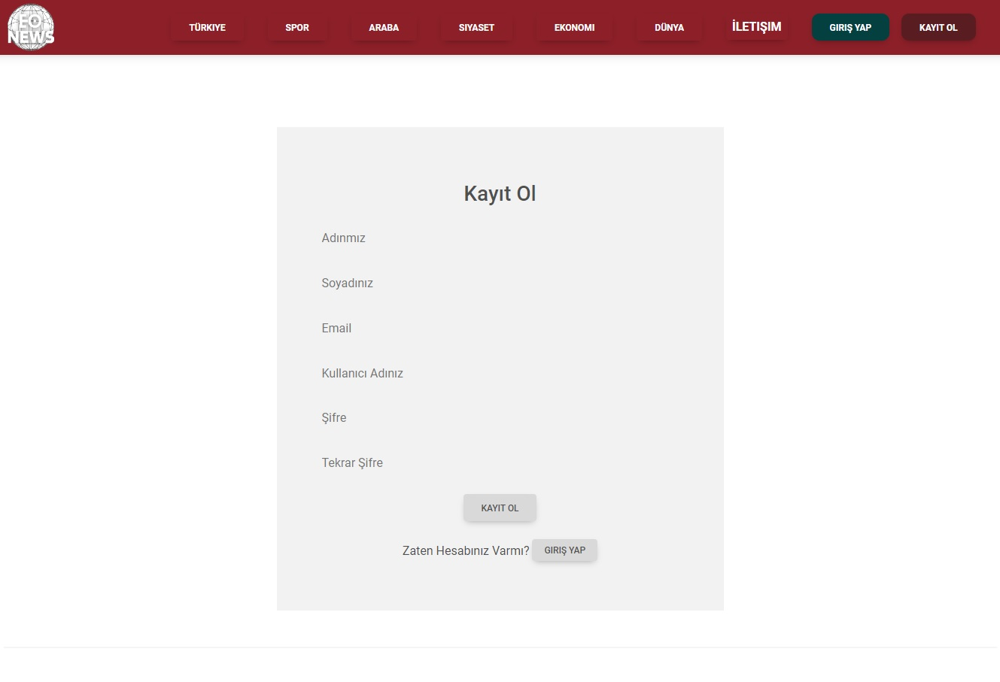
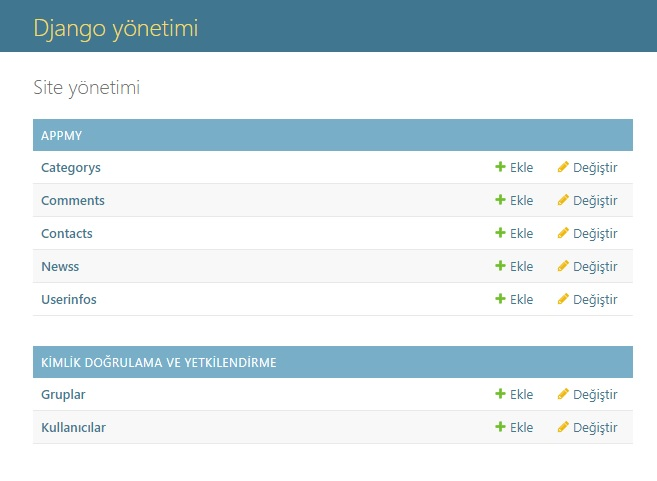
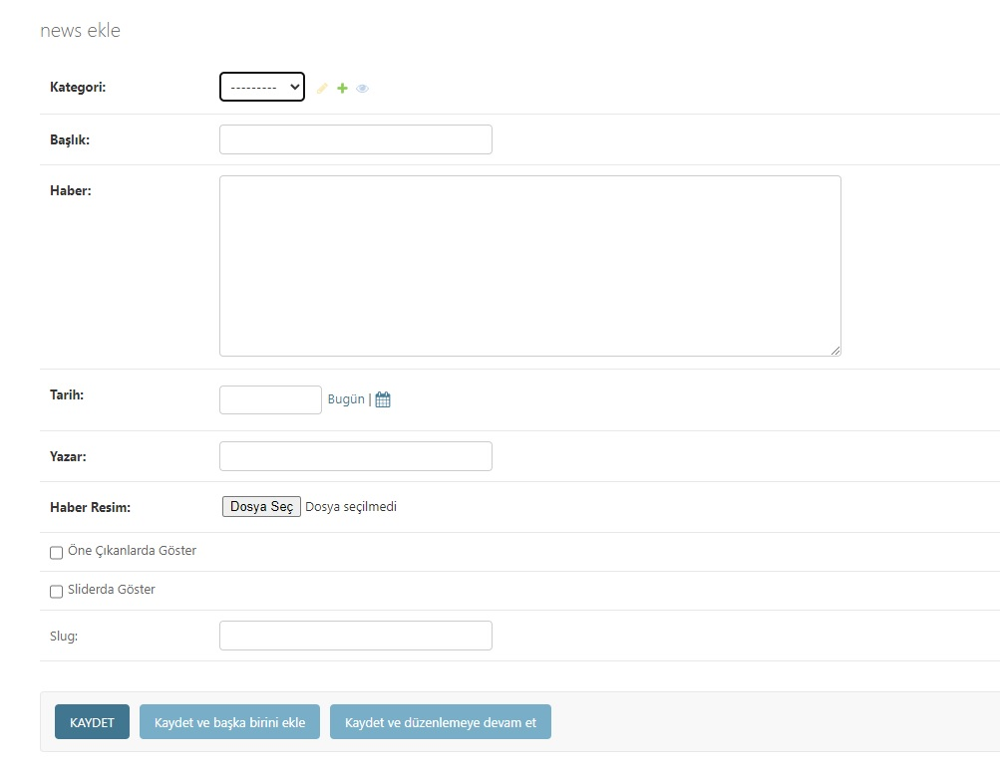

# EONEWS HABER SİTESİ

## Özet
EONEWS, haber ve güncel olaylar hakkında bilgi sağlayan bir web uygulamasıdır. Kullanıcılar, ilgi alanlarıyla ilgili haberleri takip edebilir, haberleri okuyabilir ve yorum yapabilir.Django yönetim sayesinde dinamik bir şekilde haber, kategori ve kullanıcı eklenebilir.

## Abstract
EONEWS is a web application that provides information about news and current events. Users can follow, read and comment on news related to their interests. News, categories and users can be added dynamically through Django administration.

## Özellikler
-   **Haber listesi:**  Kullanıcılar, ilgi alanlarına göre düzenlenmiş bir haber listesi görüntüleyebilir.
-   **Haber ayrıntıları:**  Kullanıcılar, haberlerin ayrıntılarını okuyabilir ve yorum yapabilir.
-  	**Haber ekleme** Django yönetim üzerinden kolaylıkla haber eklenebilir.
-   **Profil oluşturabilme:** Kendinize ait bir profil oluşturabilir ve haberleri o profil ile okuyabilirsiniz.

## Specifications
- **News list:** Users can view a list of news organized by interests.
- **News details:** Users can read and comment on the details of news stories.
- **Adding news:** News can be easily added through Django administration.
- **Create a profile:** You can create a profile of your own and read the news with that profile.

 

## Kurulum
EONEWS'i kurmak için aşağıdaki adımları izleyin:

1.  Projeyi GitHub'dan indirin.
2.  Projeyi bir web sunucusunda açın.
3.  Projenin veritabanını oluşturun.

## Installation
Follow the steps below to install EONEWS:

1. Download the project from GitHub.
2. Open the project on a web server.
3. Create the project's database.

## Kullanım
EONEWS'i kullanmak için aşağıdaki adımları izleyin:
1.  Web uygulamasını açın.
2.  İlgi alanlarınıza göre düzenlenmiş haber listesini görüntüleyin.
3.  Bir haberin ayrıntılarını okumak için habere tıklayın.
4.  Bir habere yorum yapmak için yorum kutusuna yazın.

## Usage
Follow the steps below to use EONEWS:
1. Open the web application.
2. View a list of news stories organized by your interests.
3. To read the details of a news story, click on the story.
4. To comment on a news story, type in the comment box.

## Kullanılan Teknolojiler Used Technologies

 </a>     

## İletişim
EONEWS ile ilgili herhangi bir sorunuz veya öneriniz varsa, enginorhan2000@gmail.com adresinden ulaşabilirsiniz.

## Contact
If you have any questions or suggestions regarding EONEWS, you can reach us at enginorhan2000@gmail.com.